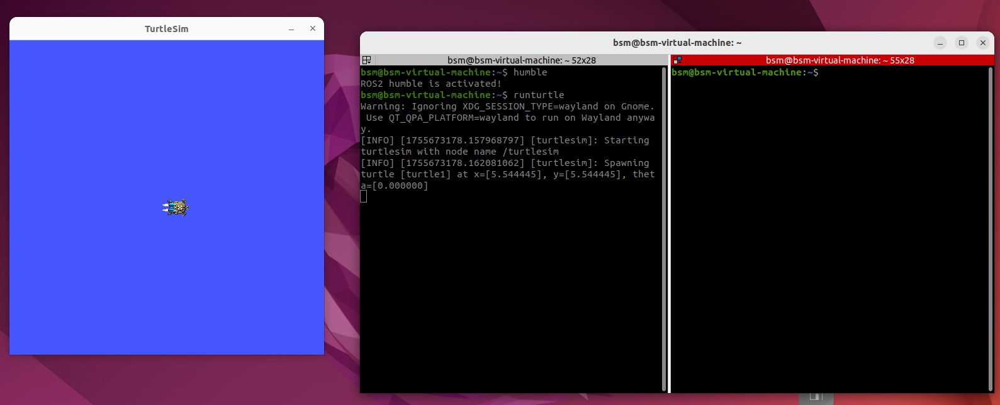
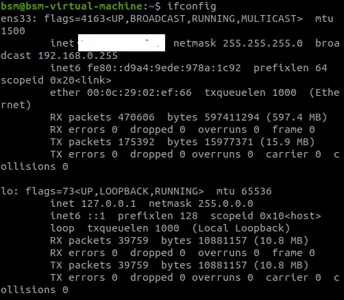
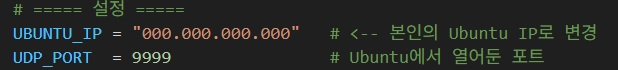
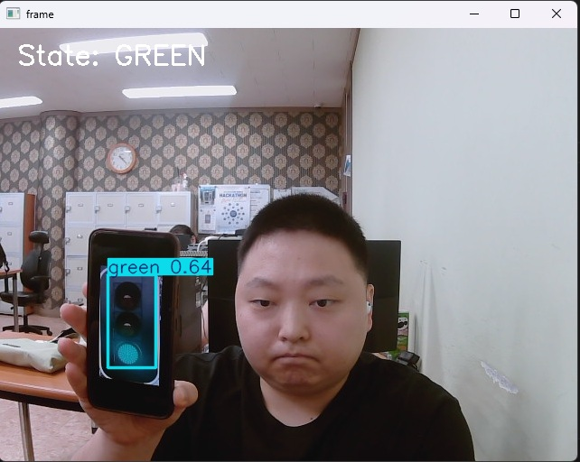
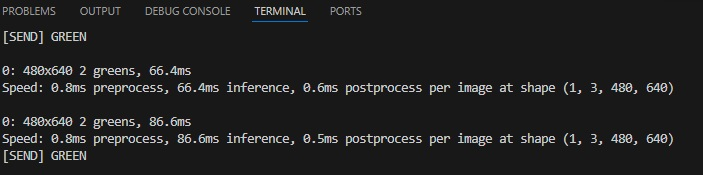
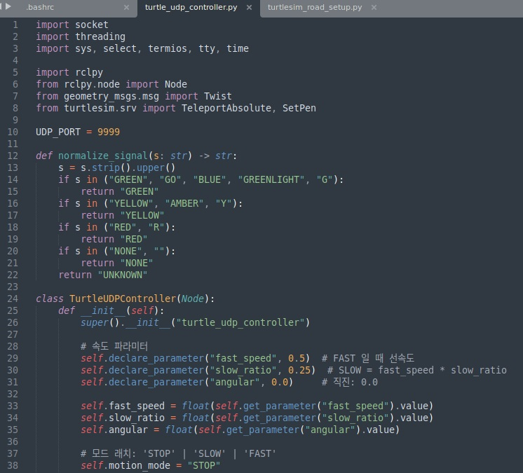
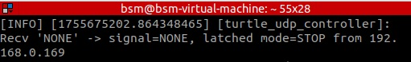
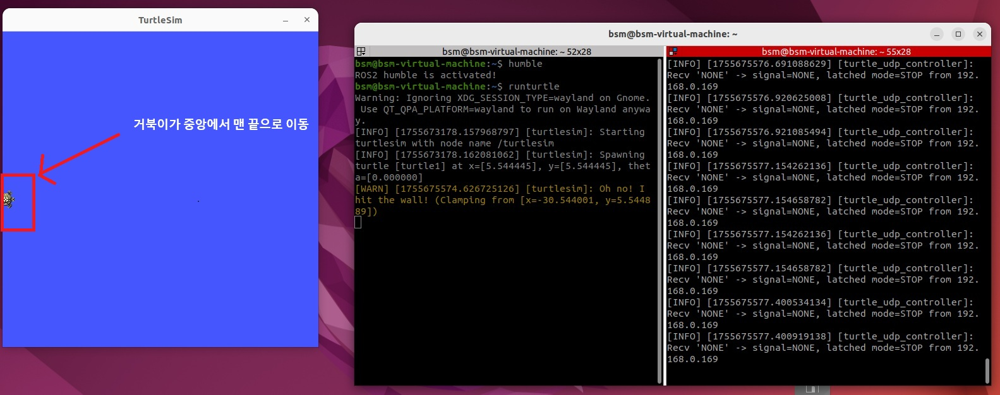
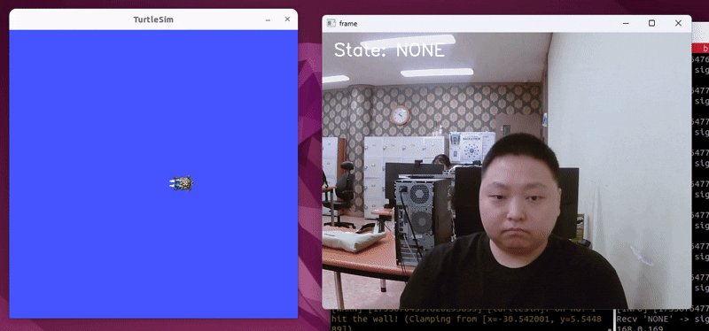

# 🟩 미니 프로젝트

**제작자** : 변상민

---

## 📡 목표

- 카메라를 통해 신호등 불빛을 자동 감지하고 그에 맞춰 ROS2의 turtle이 전진, 감속, 정지하는 시스템

---

## 📦 사용 기술

- python
    - openCV
    - ultralytics (YOLO)
    - socket (IP를 통해 연결하기 위한 라이브러리)
    - time
    - torch

- Linux (Ubuntu)

- ROS2
    - turtlesim

---

## 📋 프로젝트 구성

1. 이 프로젝트는 오픈소스로 제공되는 YOLOv8 훈련된 모델이 필요합니다.  

출처: https://github.com/Syazvinski/Traffic-Light-Detection-Color-Classification/tree/main/models 


출처 사이트로 접속해서 해당 모델을 다운로드 받고 models 경로에 저장합니다.

<br><br>

2. miniproject_test.py 코드 파일을 통해 YOLO 모델을 로드하고 웹캠을 실행한 다음, 웹캠 프레임 내에서  
추론을 시작합니다. 신호등이 잡히면 신호등 색상을 해당 웹캠 내에 (red, yellow, green) 세 개의 색상으로  
표시합니다. (파란색은 green으로 표시)

[miniproject_test.py]

```python
import cv2
from PIL import Image
from ultralytics import YOLO

# YOLO 모델 로드
model = YOLO('../models/best_traffic_small_yolo.pt')

# 카메라 열기
cap = cv2.VideoCapture(0)

while cap.isOpened():
    ret, frame = cap.read()
    if not ret:
        break

    # 현재 프레임 내에서 추론 시작
    results = model(frame)

    for r in results:
        frame = r.plot()

    # 결과 창 띄우기
    cv2.imshow('frame', frame)
    
    # 'q' 눌러서 종료
    if cv2.waitKey(1) & 0xFF == ord('q'):
        break

cap.release()
cv2.destroyAllWindows()
```


인식에 성공합니다. (거리를 조금 띄워야 인식 성공률이 올라감)

<br><br>

3. 그렇다면 기능을 하나 더 추가해보겠습니다.  

ROS2의 turtlesim 프로그램과 연동하여 신호등의 신호에 따라 거북이가 전진, 감속, 정지를 하도록 하겠습니다.  
거북이를 주행 로봇이라 가정하면 되는 것이죠.



먼저, 그림과 같이 ubuntu 22.04 환경에서 ROS2를 세팅하고 turtlesim 화면을 실행합니다. (ubuntu와 ROS2 설치 과정은 생략)  



윈도우 웹캠에서 인식한 신호 색상을 ubuntu 터미널에서 받을 수 있도록 하기 위해 ubuntu의 ip 주소를 확인합니다. (inet 부분)  
확인된 ip 주소를 바탕으로 9999 port를 통해 신호를 보내도록 합니다.



그림과 같이 본인의 ip와 9999 port를 입력합니다.  
이제, 모든 준비가 끝났습니다.

<br><br>

4. 이제 웹캠에서 추론한 신호 색상을 UDP 전송으로 보내도록 합시다.  

```python
import cv2
import socket
import time
import torch
from ultralytics import YOLO

# 신뢰 가능한 모델이라면 allowlist 등록해 안전 경고 회피
try:
    from ultralytics.nn.tasks import DetectionModel
    torch.serialization.add_safe_globals([DetectionModel])
except Exception:
    pass

# ===== 설정 =====
UBUNTU_IP = "000.000.000.000"   # <-- 본인의 Ubuntu IP로 변경
UDP_PORT  = 9999                # Ubuntu에서 열어둔 포트
CAM_INDEX = 0                   # 연결된 웹캠 인덱스

MIN_CONF  = 0.50                # YOLO confidence threshold
DEBOUNCE_N = 3                  # 같은 상태가 N프레임 연속일 때만 송신 (튀는 값 방지)
SEND_INTERVAL = 0.20            # 최소 송신 간격(초) (스팸 방지)

# YOLO 모델 로드
model = YOLO('../models/best_traffic_small_yolo.pt')

# UDP 소켓
sock = socket.socket(socket.AF_INET, socket.SOCK_DGRAM)

# 상태 디바운싱용
last_state = "NONE"
stable_counter = 0
last_sent_state = "NONE"
last_sent_time = 0.0

# 클래스명 표준화 매핑(학습한 라벨명이 다를 수 있어 유연하게 처리)
def norm_label(name: str) -> str:
    s = name.lower()
    # 자주 쓰는 변형들까지 흡수
    # "green"을 "go"처럼 라벨링했거나, yellow를 amber로 적은 경우도 커버
    if "red" in s or "빨강" in s:
        return "RED"
    if "yellow" in s or "amber" in s or "노랑" in s:
        return "YELLOW"
    if "green" in s or "초록" in s:
        return "GREEN"
    if "blue" in s or "파랑" in s:   # 만약 파란불(청색)로 라벨링되어 있다면
        return "GREEN"               # Ubuntu 쪽 매핑이 GREEN 기준이므로 GREEN으로 통일
    return "UNKNOWN"

# 한 프레임에서 최종 상태 결정: 가장 높은 conf의 신호 1개만 채택
def decide_state(results) -> str:
    best = ("NONE", 0.0)
    for r in results:
        # r.boxes: 각 감지 결과
        if r.boxes is None:
            continue
        # names: 라벨 id -> 이름 매핑 (ultralytics 모델에 포함)
        names = r.names if hasattr(r, "names") else getattr(r, "names", None)
        for b in r.boxes:
            conf = float(b.conf[0]) if b.conf is not None else 0.0
            if conf < MIN_CONF:
                continue
            cls_id = int(b.cls[0]) if b.cls is not None else -1
            cls_name = names.get(cls_id, str(cls_id)) if isinstance(names, dict) else str(cls_id)
            label = norm_label(cls_name)
            if label in ("RED", "YELLOW", "GREEN") and conf > best[1]:
                best = (label, conf)
    return best[0]

# 카메라 열기
cap = cv2.VideoCapture(CAM_INDEX)

if not cap.isOpened():
    raise RuntimeError("Camera open failed")

print("Press 'q' to quit.")
while cap.isOpened():
    ok, frame = cap.read()
    if not ok:
        break

    # YOLO 추론
    results = model(frame)

    # 상태 결정
    state = decide_state(results)

    # 디바운스: 동일 상태가 DEBOUNCE_N 프레임 연속일 때만 확정
    if state == last_state:
        stable_counter += 1
    else:
        stable_counter = 1
        last_state = state

    now = time.time()
    should_send = (stable_counter >= DEBOUNCE_N) and (
        state != last_sent_state or (now - last_sent_time) >= SEND_INTERVAL
    )

    if should_send:
        # UDP 전송 (Windows -> Ubuntu)
        sock.sendto(state.encode("utf-8"), (UBUNTU_IP, UDP_PORT))
        last_sent_state = state
        last_sent_time = now
        # 디버그 출력
        print(f"[SEND] {state}")

    # 시각화: YOLO 결과 그리기
    vis = frame.copy()
    for r in results:
        vis = r.plot()  # 박스/라벨 오버레이
    cv2.putText(vis, f"State: {state}", (20, 40), cv2.FONT_HERSHEY_SIMPLEX, 1.0, (255,255,255), 2)

    cv2.imshow('frame', vis)
    if cv2.waitKey(1) & 0xFF == ord('q'):
        break

cap.release()
cv2.destroyAllWindows()
```





사진을 보면 확인할 수 있겠지만, 웹캠 상단에 "state: GREEN" 이 추가된 것을 확인할 수 있습니다.  
인식하지 않은 상태에선 'NONE' 이라고 표시되며, 이 상태를 UDP 전송을 통해 실시간으로 ubuntu 터미널로  
보냅니다.






ubuntu 터미널에서 turtle_udp_controller.py 코드를 실행시킵니다. 이 코드는 Windows에서 받은 신호에 따라  
거북이의 움직임을 조절할 수 있게 합니다. GREEN 신호를 받으면 전진, YELLOW 신호를 받으면 감속, RED 신호를  
받으면 정지합니다.



space bar를 누르면 거북이가 시작점으로 갑니다.


GREEN 신호를 인식했을 때 거북이가 0.5 속도로 전진합니다. (turtlesim 기본 속도는 1.0)


YELLOW 신호를 인식했을 때 거북이가 기존 속도의 절반인 0.25 속도로 감속합니다.



RED 신호를 인식했을 때 거북이가 완전히 정지합니다.

---