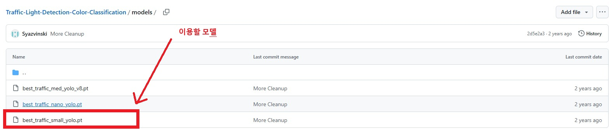
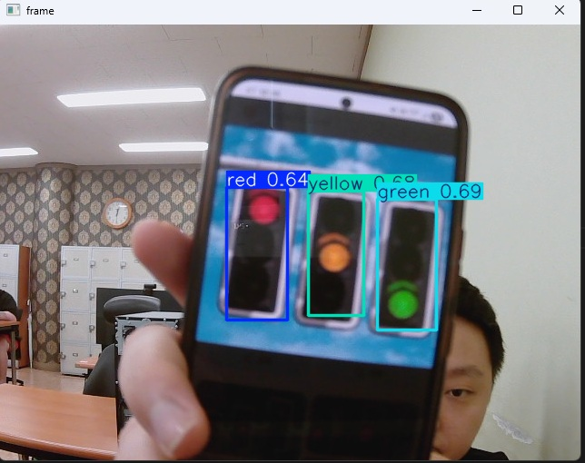

# 미니 프로젝트

**제작자** : 변상민

---

## 📡 목표

- 카메라를 통해 신호등 불빛을 자동 감지하고 그에 맞춰 ROS2의 turtle이 전진, 감속, 정지하는 시스템

---

## 📋 프로젝트 구성

이 프로젝트는 오픈소스로 제공되는 YOLOv8 훈련된 모델이 필요합니다.  

출처: https://github.com/Syazvinski/Traffic-Light-Detection-Color-Classification/tree/main/models 



출처 사이트로 접속해서 해당 모델을 다운로드 받고 models 경로에 저장합니다.

<br><br>

miniproject_test.py 코드 파일을 통해 YOLO 모델을 로드하고 웹캠을 실행한 다음, 웹캠 프레임 내에서  
추론을 시작합니다. 신호등이 잡히면 신호등 색상을 해당 웹캠 내에 (red, yellow, green) 세 개의 색상으로  
표시합니다. (파란색은 green으로 표시)

[miniproject_test.py]

```python
# 미니 프로젝트 - 신호등 및 신호 색상 인식하기
# YOLO 모델을 훈련시켜 웹캠을 통해 신호등의 신호를 실시간으로 인식시킨다.

import cv2
from PIL import Image
from ultralytics import YOLO

# YOLO 모델 로드
model = YOLO('../models/best_traffic_small_yolo.pt')

# 카메라 열기
cap = cv2.VideoCapture(0)

while cap.isOpened():
    ret, frame = cap.read()
    if not ret:
        break

    # 현재 프레임 내에서 추론 시작
    results = model(frame)

    for r in results:
        frame = r.plot()

    # 결과 창 띄우기
    cv2.imshow('frame', frame)
    
    # 'q' 눌러서 종료
    if cv2.waitKey(1) & 0xFF == ord('q'):
        break

cap.release()
cv2.destroyAllWindows()
```



인식에 성공합니다. (거리를 조금 띄워야 인식 성공률이 올라감)

<br><br>

그렇다면 기능을 하나 더 추가해보겠습니다.  

ROS2의 turtlesim 프로그램과 연동하여 신호등의 신호에 따라 